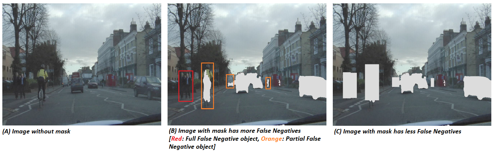
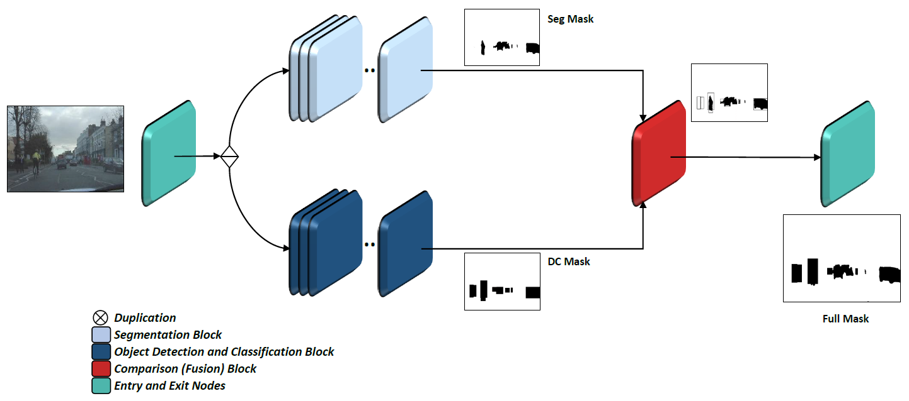
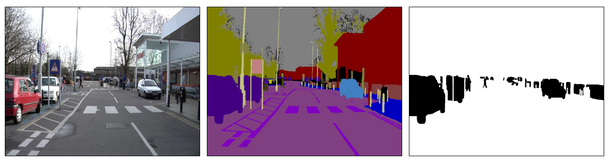
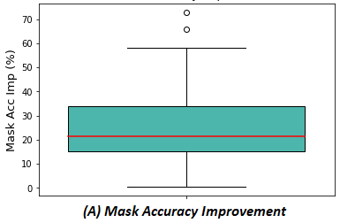
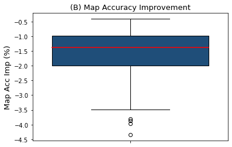
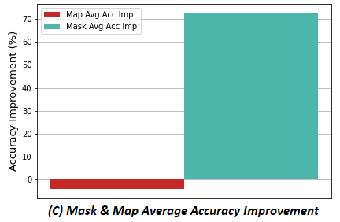

# Static Map Filter

This repo contains the code implementation for my MSc thesis: _* Static-dynamic segmentation of image sequences via deep learning *_

> Thesis report will be published after discussion and graduation.

> Note : Segmentation models and YOLOv3 code implementations are partially inherited from _https://github.com/GeorgeSeif/Semantic-Segmentation-Suite_ and _https://tinyurl.com/3jrjzzvn_ respectively.

## Objective
In this thesis work, an algorithmic method is proposed for static – quasi static (or dynamic) segmentation of images using deep learning neural networks techniques. A multi-stage model is constructed to achieve the most accurate segmentation to distinguish the static and quasi static objects in the image, with the aid of their classes that are assigned to them after classification. This algorithm might be used as a standalone method and can be utilized to enhance and provide assistance for available moving object-based segmentation methods.

## Motivation
The aim of this model is to construct a mask which excludes dynamic objects from the scene to acquire a clean map. Consequently, failing to identify a quasi-static (dynamic) object (or pixel), which is not part of the desired static map, and labeling it with “static” label mistakenly should be avoidable. In other words, committing type II error (False Negative), by considering quasi-static (dynamic) object as part of the static map, should be prevented. That is to say, the “Quality” is favored over the “Quantity” and collecting fewer and finer information for the static map is worthier than getting more information which contains extra “False Negatives” .

<table>
  <tr>
    <td></td>
  </tr>
</table>

## Model Architecture
The pipeline consists of three main blocks along with the pipeline entry and exit nodes. The binary segmentation task is performed by the “Binary Segmentation Block”, and the “Object Detection and Classification Block” is the responsible of enhancing its functionality. Lastly, “Comparison (Fusion) Block” takes the role of producing the model final mask.

<table>
  <tr>
    <td></td>
  </tr>
</table>

## Datasets:
The used datasets are CamVid, AugCamVid*, and Kitti360.
>* AugCamVid: is an extended version of CamVid, after augmenting it by brightening, flipping, and the combination of both.

### Customization:
The dataset labels were converted to binary version (_White: static elemnts, Black: quasi-static/dynamic elements_)

<table>
  <tr>
    <td></td>
  </tr>
</table>

## Used Models:
The used models are _PSPNET_, _DeepLabV3+_, and _DenseASPP_.
>Extra models can be implemented easily by checking the code of the previousely mentioned repo.

## Results:
The overall results show noticeable improvement for the "Mask accuracy"* with acceptable degredation of the "Map accuracy"* , which led to cleaner and finer produced masks.
>* Each pixel in the image is either classified as a static or a quasi-static pixel. "Mask accuracy" evaluates how good is the mask in terms of detecting the quasi static (dynamic) objects, while "Map accuracy" measures the amount of information collected from the scene.

>* "Mask accuracy" is the main KPI , due to the criticality of committing type II error by the model.

<table>
  <tr>
    <td></td>
    <td></td>
    <td></td>
  </tr>
</table>

# License
<a href="./LICENSE">MIT License</a>.
